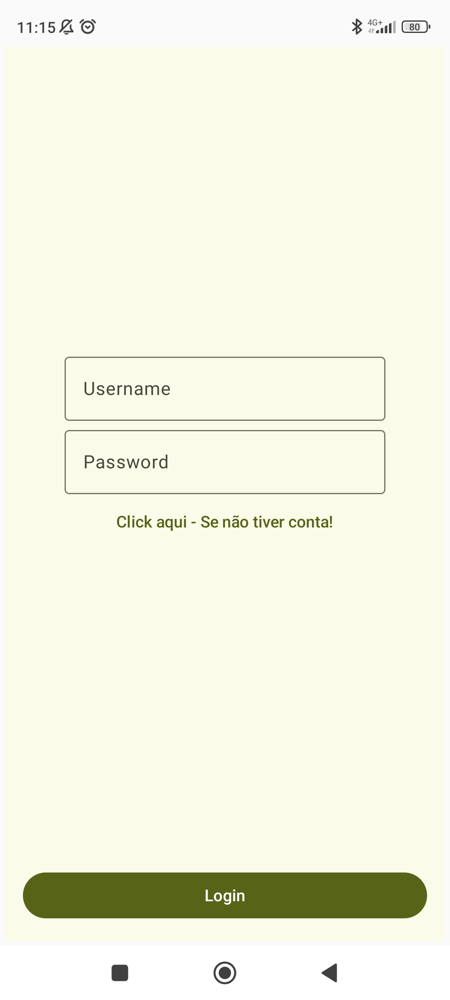
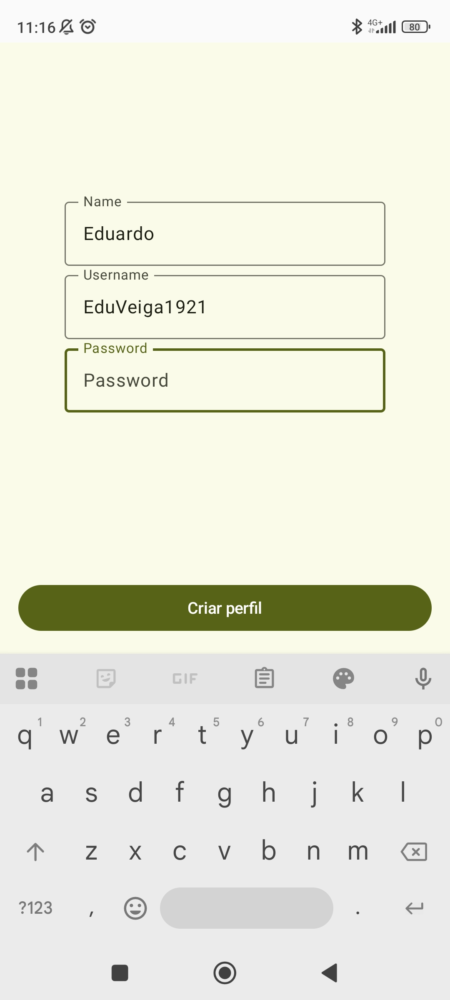
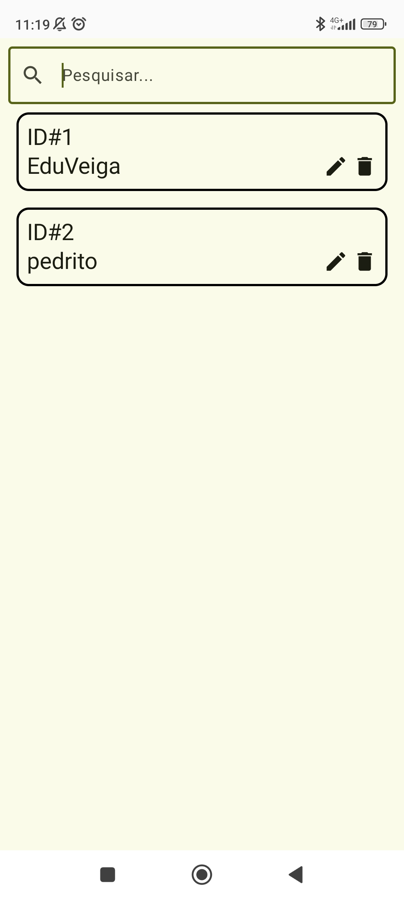
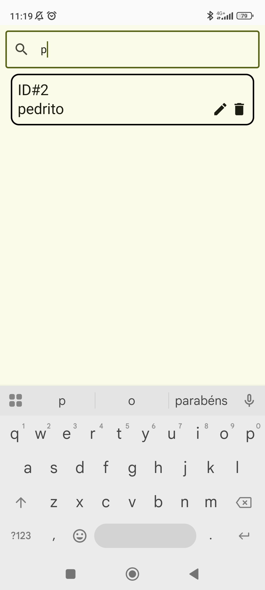

# 👤 Profile Manager App

## 📱 About
This is a simple Android application that allows users to create, manage, and search profiles.

The main goal of this project was to practice core Android development concepts, including state management, navigation, and manual dependency injection.

---

## 🏗️ Architecture
- MVVM (Model-View-ViewModel)
- Clean Architecture (Data, Domain, Presentation)

The project follows a structured approach to keep the code modular and maintainable.

---

## 🛠️ Tech Stack
- Kotlin
- Jetpack Compose
- Room (Local Database)
- ViewModel
- Navigation Component

👉 Dependency Injection was implemented manually (without using frameworks like Hilt) to better understand how DI works under the hood.

---

## ✨ Features
- User login (basic implementation)
- Create new profiles
- View list of profiles
- Search profiles by name
- Local data persistence

---

## 📸 Screenshots

  
  

  
  

---

## 🧠 What I Learned
- Implementing MVVM architecture in practice
- Managing UI state with ViewModel
- Working with Room for local data persistence
- Implementing manual dependency injection
- Handling search and filtering logic

---

## 🚀 Future Improvements
- Improve UI/UX design
- Add form validation
- Improve login system (authentication logic)
- Add unit tests

---

## 📌 Notes
This project was built mainly for learning purposes and to reinforce core Android development concepts.
